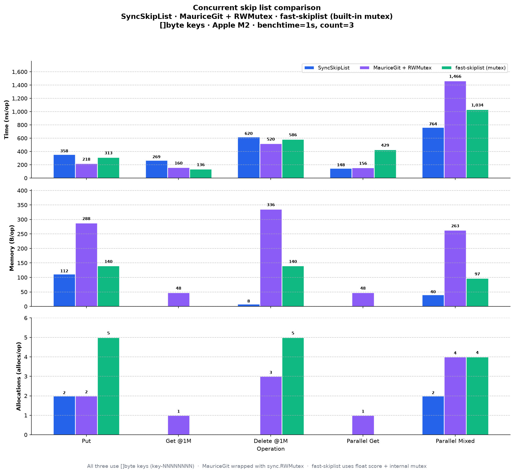
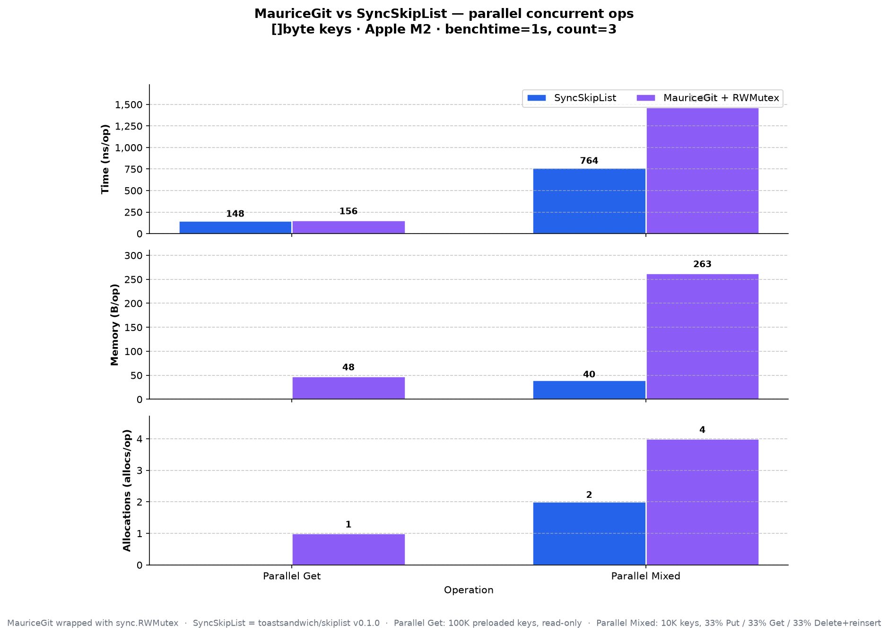

# skiplist

Simple skip list for Go.

Sorted `[]byte` key/value store with expected O(log n) operations.

## Install

```bash
go get github.com/toastsandwich/skiplist
```

## Usage

```go
import "github.com/toastsandwich/skiplist"

s := skiplist.NewSkipList(0, 0) // defaults: max level 32, p 0.5

if err := s.Put([]byte("user:1"), []byte("Alice")); err != nil {
    // handle ErrNilKey, ErrNilVal, or ErrSkiplistFull
}

val, err := s.Get([]byte("user:1"))
if err == skiplist.ErrKeyNotFound {
    // missing key
}

for k, v := range s.All() {
    // sorted order
}

s.ForEach(func(k, v []byte) bool {
    return true // return false to stop early
})

if err := s.Pop([]byte("user:1")); err != nil {
    // handle ErrKeyNotFound or ErrNilKey
}

n := s.Len() // O(1) entry count
```

Pass `0` for either `NewSkipList` argument to use defaults. `DefaultValues()` returns those defaults explicitly: `(32, 0.5)`.

### Optional size limit

Set `MaxLen` on the list to cap how many distinct keys it holds. `0` means unlimited. Updates to existing keys still succeed when full; only new inserts return `ErrSkiplistFull`.

```go
s := skiplist.NewSkipList(32, 0.5)
s.MaxLen = 1000
```

## API

| Method | Returns | Notes |
|--------|---------|-------|
| `Put(key, val)` | `error` | Insert or update |
| `Get(key)` | `([]byte, error)` | Zero allocs on hit |
| `Pop(key)` | `error` | Remove by key |
| `All()` | `iter.Seq2[[]byte, []byte]` | Sorted iteration via `range` |
| `ForEach(fn)` | — | Callback iteration; return `false` to stop |
| `Len()` | `int` | Current entry count |

Exported errors: `ErrNilKey`, `ErrNilVal`, `ErrKeyNotFound`, `ErrSkiplistFull`.

Not safe for concurrent use.

## SyncSkipList (concurrent)

Use `SyncSkipList` when multiple goroutines hit the same map. It wraps the same logic with an `RWMutex` — many readers, one writer at a time.

```go
s := skiplist.NewSyncSkipList(0, 0)

if err := s.Put([]byte("user:1"), []byte("Alice")); err != nil {
    // handle error
}

val, err := s.Get([]byte("user:1"))

if err := s.Pop([]byte("user:1")); err != nil {
    // handle error
}

n := s.Len() // int64
```

**Ownership:** `Put` takes the key and value slices. Do not reuse or mutate them after the call.

| Method | Returns | Notes |
|--------|---------|-------|
| `Put(key, val)` | `error` | Insert or update; takes slice ownership |
| `Get(key)` | `([]byte, error)` | Safe concurrent reads; zero allocs on hit |
| `Pop(key)` | `error` | Remove by key |
| `Len()` | `int64` | Current entry count |
| `Cap()` | `int64` | Max entries allowed |

No `All()` or `ForEach()` on `SyncSkipList` yet.

## How Skip Lists Work

A skip list is a sorted linked list with extra "express lane" layers on top.

```
Level 2: HEAD ----------------------> [50] ------------> NIL
Level 1: HEAD ----------> [20] --> [50] --> [80] --> NIL
Level 0: HEAD --> [10] --> [20] --> [50] --> [80] --> NIL
```

- Every element lives on level 0.
- On insert, a node is randomly assigned a height. With the default p=0.5:
  - ~50% stay at level 0
  - ~25% reach level 1
  - ~12.5% reach level 2, and so on
- Search starts at the highest level, skips forward while keys are smaller, then drops down levels.
- Higher levels act as shortcuts, giving expected **O(log n)** performance for put, get, and delete.

## Benchmarks (heavy load)

```bash
# SkipList
go test -run=^$ -bench='BenchmarkSkipList' -benchmem -count=3 -benchtime=1s

# SyncSkipList
go test -run=^$ -bench='BenchmarkSyncSkipList' -benchmem -count=3 -benchtime=1s
```

### SkipList (Intel Core i7-11800H)

| Op            | ns/op  | allocs/op |
|---------------|--------|-----------|
| Put           | 268    | 3         |
| Get           | 244    | 0         |
| Pop           | 572    | 4         |
| PutGetMix     | 619    | 3         |

### SyncSkipList (Apple M2)

| Op            | ns/op  | allocs/op |
|---------------|--------|-----------|
| Put           | 350    | 2         |
| Get           | 260    | 0         |
| Pop           | 625    | 0         |
| PutGetMix     | 720    | 2         |

Notes for both:

- `Get`, `Pop`, and `PutGetMix` run against a preloaded list of 1M elements.
- `Pop` benchmark does pop + re-insert to keep size stable.

`Get` has zero allocations on hits for both types.

### Charts

Three-way comparison of concurrent skip list implementations on Apple M2 (`benchtime=1s`, `count=3`). All use `[]byte` keys (`key-NNNNNNNN`). MauriceGit is wrapped with `sync.RWMutex`; fast-skiplist uses its built-in mutex.



Head-to-head under parallel load: 100K preloaded keys (read-only) and 10K keys with mixed 33% Put / 33% Get / 33% Delete+reinsert.



## License

MIT
